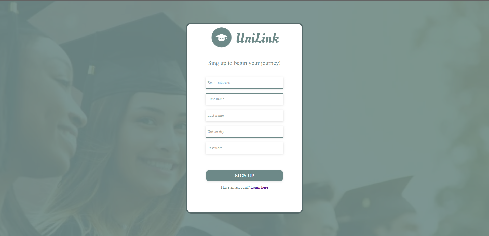

# UniLink

> A site for students looking for activities in the area.

## Table of contents

* [About website](#about-website)
* [Technologies Used](#technologies-used)
* [Features](#features)
* [Roles](#roles)
* [Database](#database)
* [Launch](#launch)
* [Screenshots](#screenshots)

## About website

This application is designed to help students discover exciting events in their local area. Targeting exclusively students enhances the app's security and focuses its audience on a similar age group. Users can both apply to attend events and create their own, fostering connections with like-minded groups who share similar interests.

## Technologies Used

### Front-end

- HTML
- CSS
- JS

### Back-end

- PHP

### Database

- PostGreSQL

### Other

- Docker
- Git
- NGINX

## Features

These are the most important features:

- The application implements a tiered system of roles: administrator, user, and guest. Each role possesses progressively advanced permissions.
- A database transaction system has been developed to enhance the security of event participation submissions.
- Validation mechanisms and automatic removal of expired events have been implemented.
- Session-based user login management has been implemented.

## Roles

The table below illustrates permissions associated with each role:

| Role | Browsing events | Submitting participation | Adding an event | Removing an event
| ------------- | ------------- | ------------- | ------------- | ------------- |
| Admin  | X | X | X | X |
| User  | X | X | X | |
| Guest | X | | | | |

## Database structure

### ERD

### Description

- **users** - A table with user data.
- **details** - A table containing user login data.
- **permissions** - A table listing applied permissions.
- **attendance** - A table containing information about users' participation in events.
- **events** - A table containing detailed information about added events.

## Launch

### Web application

To access the web application, follow these steps:

1. Clone the project.
2. Run `docker-compose up` in main directory.
3. Wait for the creation of the necessary containers.

The application has been launched! You can enter it by typing `localhost:8080` into your browser's address bar. You can use the application as a guest by clicking the `TRY IT AS A GUEST` button or as a user by creating your own account for this purpose. If you wish to utilize administrator privileges, log in to the application using the following credentials:

| Email | Password |
| ------------- | ------------- |
| admin@unilink.com | admin |

### Database

To access the database, follow these steps:

1. Go to location `http://localhost:5050`
2. Log in using administrator credentials:
   
  | Email | Password |
  | ------------- | ------------- |
  | admin@unilink.com | admin |

3. Register the database server using internal credentials:
   
  | Host | Port | Maintenance database | Username | Password |
  | ------------- | ------------- | ------------- | ------------- | ------------- |
  | db | 5432 | db | docker | docker |

## Screenshots
Here are some screenshots from the website.

